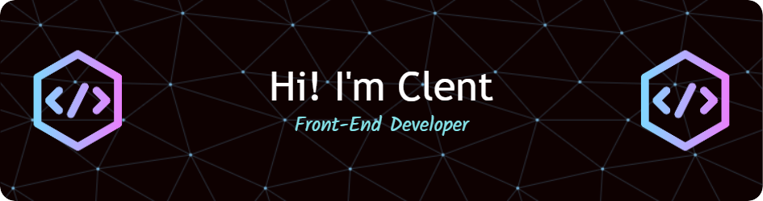

  
  
  

 

  
I specialize in JavaScript and ReactJS, and I'm always looking to learn more about the latest web development trends and technologies. When I'm not coding, you can find me exploring the beautiful landscapes of Philippines and indulging in its rich culture and cuisine. Let's connect and create something amazing together! 👋 

---

### :man_technologist: About Me :

- :telescope: I’m working as a Software Engineer and contributing to frontend and backend for building web applications.

- :zap: In my free time, I solve problems on GeeksforGeeks and read tech articles.

- :mailbox:How to reach me: 

---

### :hammer_and_wrench: Languages and Tools :

  &nbsp;
  &nbsp;
  &nbsp;
  &nbsp;
  &nbsp;
  &nbsp;
  &nbsp;
  &nbsp;
  &nbsp;
  &nbsp;
  &nbsp;
  
   

